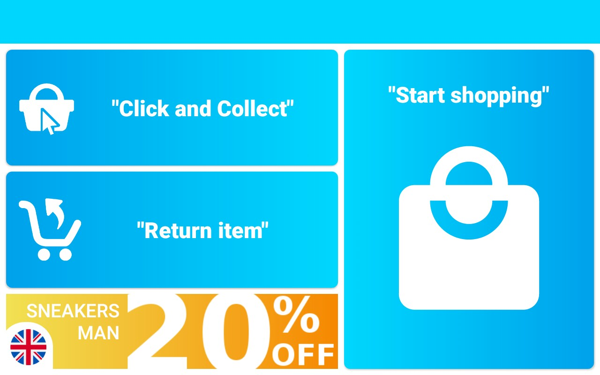
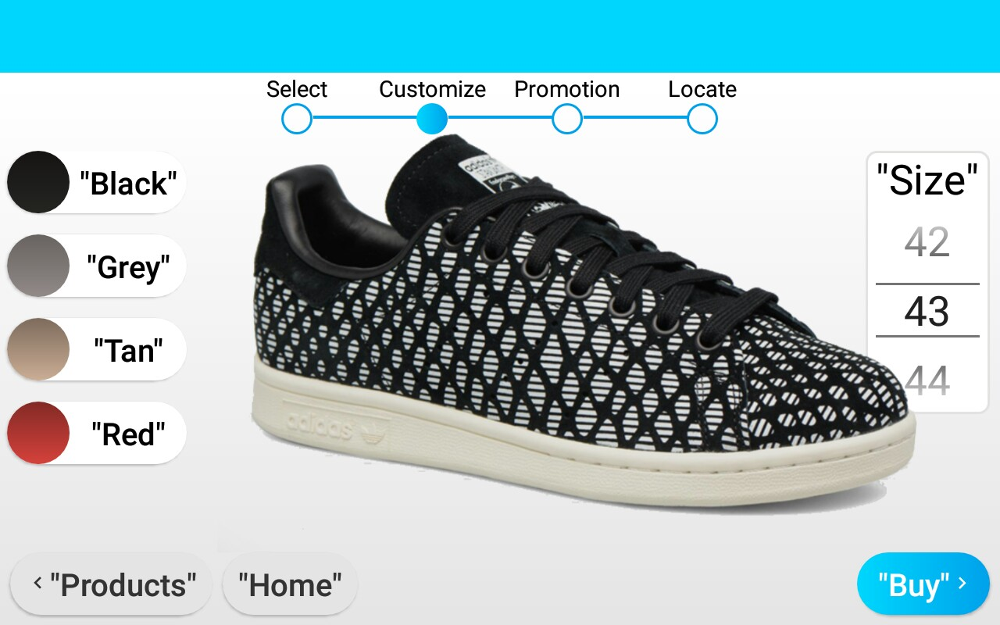
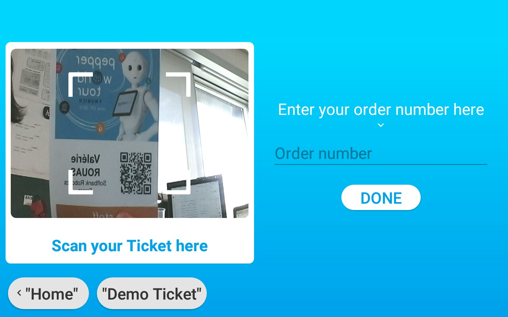
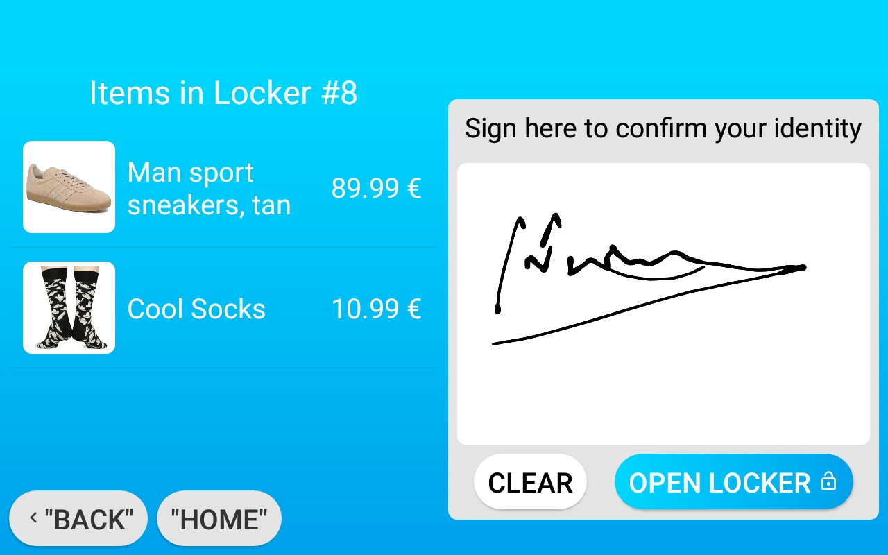
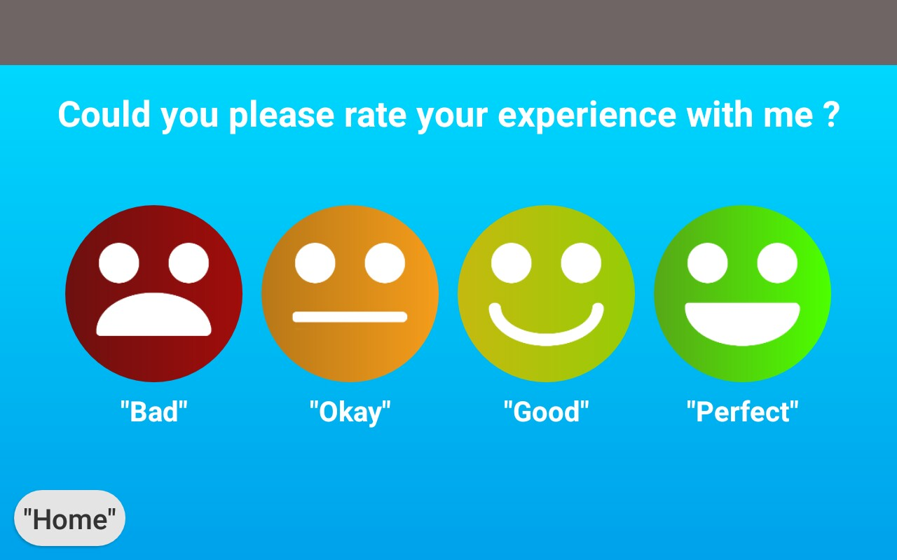

# Retail Demo

This app showcases the capabilities of pepper in the retail sector, we suppose here that the robot is placed in a shoe store, the app is split into three main sections  : shopping for shoes, returning an item and picking up an item that was ordered online. The main features of the app and the sections they are used in are described in the table below.

| Features | Section |
| ------------- | ------------- |
| Human awareness, detecting age + gender  	| Shopping |
| QiChat variables, communication with android |  Shopping |
| Possibility to sign on the tablet | Pick up|
| Reading QRcodes thanks to the tablet camera  | Return, Pick up|
| Sending emails | Shopping |
| Screen to get user feedback | Return, Pick up, Shopping |

## Compatibility

Tested running on pepper 1.8 and 1.8a, using NAOqi 2.9.4, QiSDK 1.6, on first startup pepper will ask the permission to use the camera (to scan the qrCodes) as well as the Gmail credentials that will be used to send emails(you can create a gmail address for this), a popup will also show up the first time you send an email, please make sure to do all this setup before showcasing the app.

If you need to change the email credentials you can just empty the application's cache, the popup will show up on app startup again, make sure to resend an email again after changing them. 

## Screenshots

